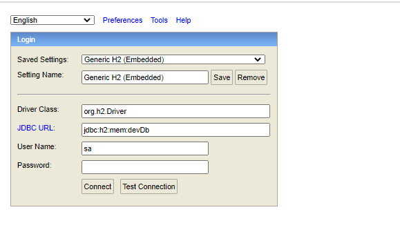
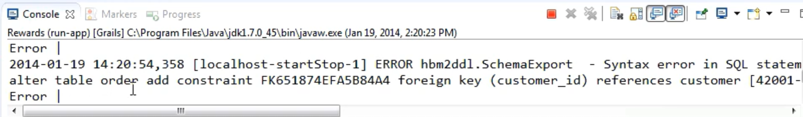

## Troubleshooting Application

#### Grails Error: Error occurred running Grails CLI: No profile found for name [web].

```text
Sometimes after upgrading the version of Intelli-J that I'm using for development, when I try to run the command-line grails program, I receive the following error message:

Error occurred running Grails CLI: No profile found for name [web].
After searching around the web, I found that this was due to a problem with the build/.dependencies file located within your Grails project root. If you delete or rename this file, then run grails again, the dependencies will be corrected and you can run your app.

https://www.malcontentboffin.com/2016/12/Grails-Error-Error-occurred-running-Grails-CLI-No-profile-found-for-name-web-.html

```

#### database config

connect local database here: http://localhost:8080/h2-console



#### sql error due to "Order" class 



- Rename Domain class "Order" to "OnlineOrder"