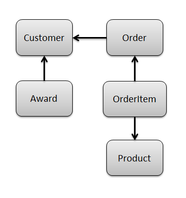
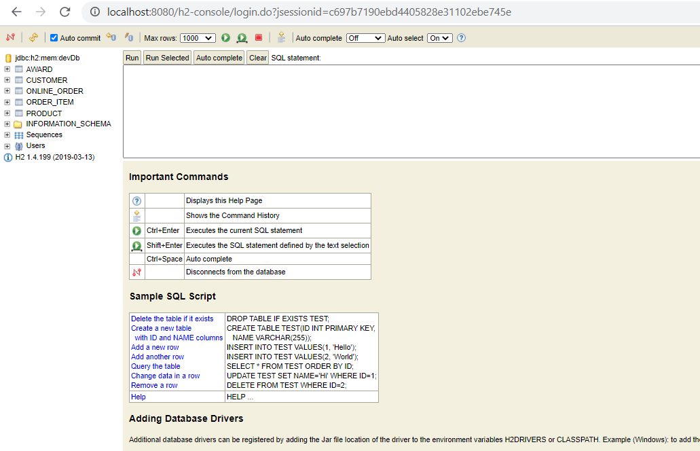

## Designing the data layer:

- Defining Requirements 
- Adding Domain classes and field types
- Adding relationship between domain classes. 
-  inward arrow: many to one 
- outward arrow: one to many

### Requirements: 



--------------------------------------------------------------------------------------------------
- When customer orders beverage, he receives reward. 
- A **customer can receive many awards** and every award belong to one and only one customer.
- Customer can go online and place order. 
- Order belong to one and only one customer but **one customer can place many order**. 

- An online order can contain many items 
- Each Item will belong to only one order. 

- You purchase a product in each order item. 
- Each Order item will have only one product.
--------------------------------------------------------------------------------------------------
#### Fields required for each domain class: 
```text
Customer: First Name, Last Name, Phone, Email, Total Points. 
Award:  Date, Type, Points. 
Order: Data, OrderNumber, Order Total. 
Order Item: Quantity, Total Cost. 
Product: SKU, Name , Price. 
```

--------------------------------------------------------------------------------------------------
#### Creating Domain classes
- Create all 5 domain class as above ( Product is already created before).
- Right click domain folder and create respective domain class.
- Add fields with their types in respective domain class created.

-----------------------------------------------------------------------------------------------------------

#### Defining Relationship between each domain classes: 
- we will define both relationship of Customer and Award viz.Customer having many relationships with Award and Award having one relationship with customer. 
- with this we will achieve cascading behavior so when we will query Customer we will automatically get awards. 
- Similarly, deleting Customer will automatically delete all its awards. 
 
- Customer is parent to two domain classes : Award and Order. 
```text
static hasMany = [awards:Award, onlineOrders:OnlineOrder]
``` 
- Similarly, Award is child to Customer: 
```text
static belongsTo = [customer:Customer]
```   

- After running application it will create remaining 4 database tables, and we can access them here: **http://localhost:8080/h2-console/**





